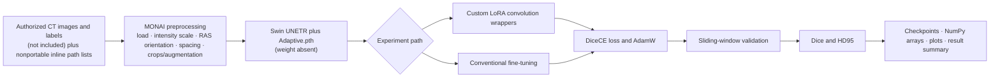

# Parameter-Efficient Fine-Tuning and Few-Shot Learning of Multiscale Vision Transformers for Liver Tumour Segmentation in CT

[](https://doi.org/10.1117/12.3046253)

Research code snapshot accompanying:

> Ramtin Mojtahedi, Mohammad Hamghalam, Jacob J. Peoples, William R. Jarnagin, Richard K. G. Do, and Amber L. Simpson. “Parameter-Efficient Fine-Tuning and Few-Shot Learning of Multiscale Vision Transformers for Liver Tumour Segmentation in CT.” *Medical Imaging 2025: Computer-Aided Diagnosis*, Proceedings of SPIE 13407, article 1340738 (2025). [https://doi.org/10.1117/12.3046253](https://doi.org/10.1117/12.3046253)

<!-- repository-guide:start -->
## At a glance

[Paper](https://doi.org/10.1117/12.3046253) · [LoRA notebook](Notebooks/LORA.ipynb) · [Fine-tuning notebook](Notebooks/FineTune_Scratch.ipynb) · [Recorded results](Results/Results.md) · [`CITATION.cff`](CITATION.cff)

### Dependency evidence

| Package | Evidence in the notebooks |
|---|---|
| `torch` | Model construction, optimization, checkpoints |
| `monai` | Transforms, Swin UNETR, losses, sliding-window inference, metrics |
| `numpy` | Cached manifests and saved metric arrays |
| `matplotlib` | Loss, metric, and timing plots |
| `tqdm` | Training and validation progress |
| `natsort` | File ordering |
| `scipy` | Connected-component analysis |

No dependency versions are recorded. `Models/ssl_pretrained_weights.pth` is a one-byte newline placeholder, not a checkpoint.

### Workflow represented by the notebooks



> **Reproducibility boundary:** the committed cells record research-session workflows, including selected subset experiments, but the data, complete portable manifests, usable pretrained weight, exact split provenance, and pinned environment are absent.
<!-- repository-guide:end -->

## Repository status

This repository is an archival research snapshot, not a packaged or end-to-end reproducible software release. It contains two experiment notebooks and a written results summary. It does **not** contain the clinical CT dataset, segmentation labels, complete data manifests, a pinned software environment, or usable trained checkpoints.

The notebooks preserve hard-coded institutional storage paths, notebook outputs, and assumptions about the original GPU environment. They require adaptation before use. The file `Models/ssl_pretrained_weights.pth` is a one-byte placeholder containing only a newline; it is **not** a loadable model checkpoint.

## Study overview

The study investigates Low-Rank Adaptation (LoRA) for parameter-efficient fine-tuning of a Swin UNETR liver tumour segmentation model and evaluates few-shot training regimes. The paper is the authoritative source for the cohort, experimental design, and reported findings.

The material in this repository is supplied to make the research implementation and recorded outputs easier to inspect. It should not be treated as a validated clinical system.

## What is included

| Path | Contents |
| --- | --- |
| `Notebooks/LORA.ipynb` | LoRA-based Swin UNETR experiment workflow with preserved research-session code and outputs. |
| `Notebooks/FineTune_Scratch.ipynb` | Comparison/fine-tuning workflow with preserved research-session code and outputs. |
| `Results/Results.md` | A summary of reported Dice and HD95 results. These values have not been independently regenerated from this repository snapshot. |
| `Models/ssl_pretrained_weights.pth` | One-byte placeholder, not usable weights. |
| `CITATION.cff` | Machine-readable repository and preferred paper citation metadata. |

No patient images, annotations, full checkpoints, dependency lock file, or command-line training package are included.

## Getting the snapshot

```bash
git clone https://github.com/Ramtin-Mojtahedi/PEFT-FSL-MViT-LTS.git
cd PEFT-FSL-MViT-LTS
```

No `requirements.txt`, Conda environment file, or tested compatibility matrix is supplied. Imports in the notebooks indicate an environment including Jupyter, PyTorch, MONAI, NumPy, Matplotlib, tqdm, natsort, and SciPy, plus a compatible CUDA stack for GPU training. Exact versions from the original experiments are not recorded here.

## Preparing the snapshot

Before attempting an experiment:

1. Obtain appropriately authorized CT images and segmentation labels. The repository does not distribute the study data or grant access to it.
2. Create and document a compatible PyTorch/MONAI environment. Package versions, CUDA versions, and hardware assumptions must be established and tested by the user.
3. Work on copies of the notebooks and review cells before execution; saved outputs may reflect the authors' original session rather than your environment.
4. Replace all `/mnt/largedrive0/...` paths and the recorded `/home/...` environment references with paths for your system.
5. Replace hard-coded image/label lists with a documented local manifest, preserving patient-level separation between training, validation, and test sets.
6. Supply the pretrained checkpoints referenced by the notebooks, such as `Adaptive.pth`, only from a source you are authorized to use. The placeholder in `Models/` cannot be loaded.
7. Verify preprocessing, label conventions, random seeds, LoRA layer selection, checkpoint loading, metrics, and few-shot sampling before interpreting results.

Because the data, full environment specification, data manifests, and checkpoints are absent, reproducing the paper results from this snapshot alone is not currently possible.

## Data access, privacy, and governance

The study used clinical CT images and corresponding tumour annotations. These data are not stored in this repository. Any access or reuse must follow the applicable institutional approvals, consent or waiver conditions, data-use agreements, privacy requirements, and secure-computing rules. Contact the authors through the published paper or open a repository issue to ask about data-access procedures; access cannot be assumed or guaranteed.

Do not upload patient data, protected health information, credentials, internal manifests, or private storage paths in an issue or pull request.

## Results and intended use

The values in [`Results/Results.md`](Results/Results.md) are a record of results associated with the study; they are not a fresh verification run. Refer to the [published paper](https://doi.org/10.1117/12.3046253) for the evaluated methods, analysis, and conclusions.

This code is provided for research inspection and method development only. It has not been validated for diagnosis, treatment planning, or other clinical decision-making.

## Citation

If this repository supports your work, cite the paper rather than only the GitHub URL. GitHub and citation managers can also read [`CITATION.cff`](CITATION.cff).

```bibtex
@inproceedings{mojtahedi2025parameter,
  author    = {Mojtahedi, Ramtin and Hamghalam, Mohammad and Peoples, Jacob J. and Jarnagin, William R. and Do, Richard K. G. and Simpson, Amber L.},
  title     = {Parameter-Efficient Fine-Tuning and Few-Shot Learning of Multiscale Vision Transformers for Liver Tumour Segmentation in CT},
  booktitle = {Medical Imaging 2025: Computer-Aided Diagnosis},
  volume    = {13407},
  pages     = {1340738},
  year      = {2025},
  publisher = {SPIE},
  doi       = {10.1117/12.3046253}
}
```

## License and reuse

No software license has been declared for this repository. Public visibility of the source does not by itself grant permission to copy, modify, redistribute, or incorporate it into another project. Contact the authors and any other relevant rightsholders before reuse. The citation metadata in `CITATION.cff` is provided for attribution and does not create a license grant.

## Questions and contributions

Please use [GitHub issues](https://github.com/Ramtin-Mojtahedi/PEFT-FSL-MViT-LTS/issues) for questions about the code or documentation. Do not include sensitive data in public discussions. Proposed documentation and portability improvements are welcome, subject to the repository's current no-license status.
